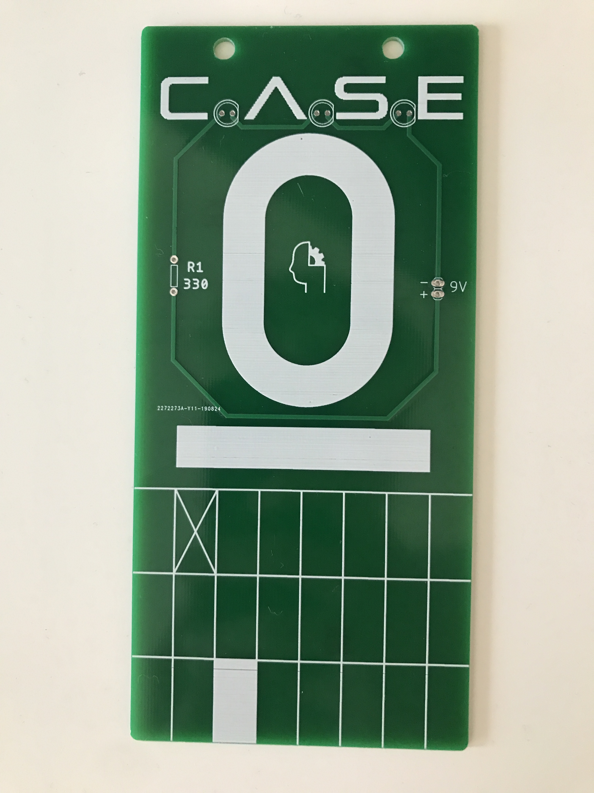
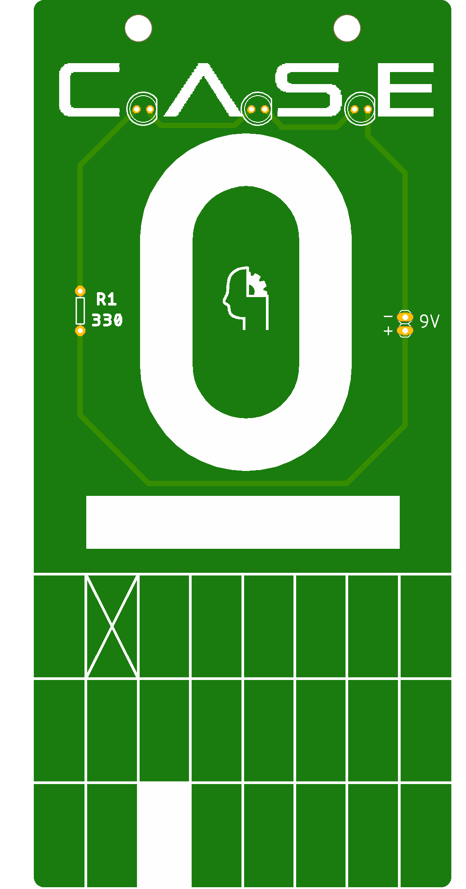

# CASE Nollbricka
At Chalmers all new students (nollan) must have a fin nollbricka to wear. A CASE nollbricka is a very very nice nollbricka. It has nice art, weather resistance if you talk a dopp in the ocean and has 3 built in LEDs, that's big.

### Assembly
You can either wear CASE Nollbricka as is or attach a 9V battery, 330 ohm resistor and 3 LEDS.  You can solder the components at the CASE lab, wink wink ;).